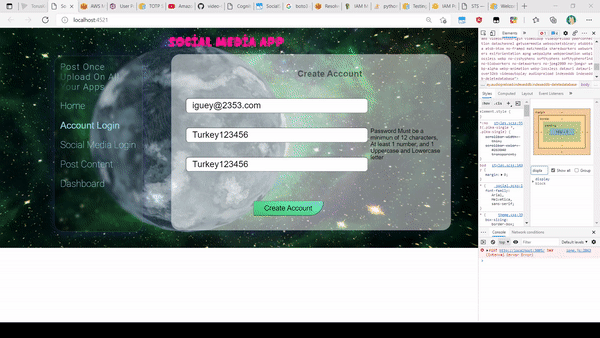
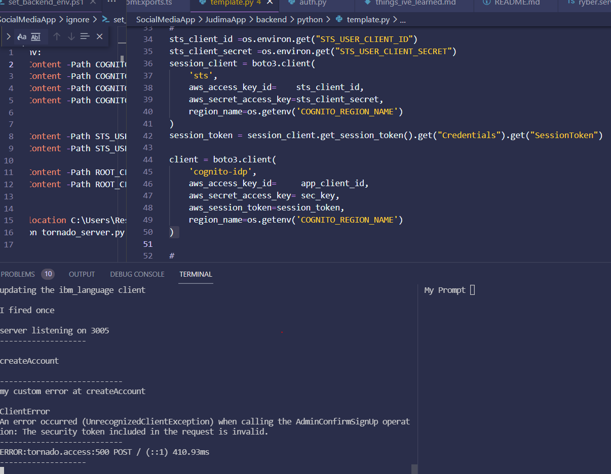
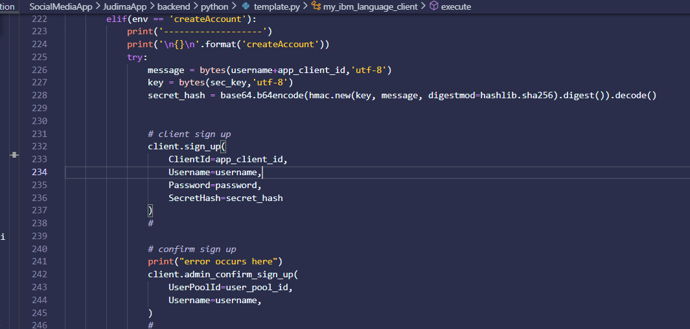

# Invalid Security Token

## Expected Behavior
boto3 cognito-idp should accept my session token created from root credentials from the root IAM user, (client insiatiend with boto3 sts) and perform the operations(admin_confirm_user,admin_update_user_attributes ..., )

## Current Behavior
boto3 cognito-idp client keeps complaing about and invalid security token, and when I try to 
boto3 sts client from cognito user credentials it complains its own security token is invalid because it does have any

## Possible Solution
show us a way to assign roles and policies cognito user client or access the cognito user in the aws console


## Steps to Reproduce





## Environment
|property|value|data|
|:------|:------:|------|
|OS|Microsoft Windows 10 Pro||
|Frontend Application|Angular v 11.2.14||
|Backend Application|Python v3.9.5||
|boto3|boto3==1.17.107, botocore==1.20.107,s3transfer==0.4.2||


__FILE requirements.txt__
```txt
boto3==1.17.107
botocore==1.20.107
certifi==2021.5.30
chardet==4.0.0
idna==2.10
jmespath==0.10.0
lorem==0.1.1
Pillow==8.3.1
protobuf==3.17.3
PyJWT==2.1.0
python-dateutil==2.8.1
python-dotenv==0.18.0
requests==2.25.1
s3transfer==0.4.2
six==1.16.0
tornado==6.1
urllib3==1.26.6
watchdog==2.1.3
```


# Social Media Help


I have an Invalid Security Token Error when I try to use boto3 congito-idp client for admin operations, were are using the sts client instantiated by root credentials to no avail anyone know the issue 

git hub issue
https://github.com/aws-samples/amazon-cognito-example-for-external-idp/issues/59
https://user-images.githubusercontent.com/21322737/125154364-ac8fa000-e127-11eb-9cfa-1586b64e83d7.gif
