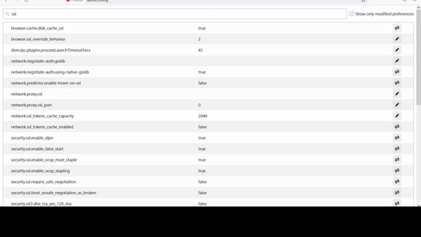

# Puffing Billy Receiving Requests but not Responses from Firefox
<!--- Provide a general summary of the issue in the Title above -->

## Expected Behavior
the browser should allow for the insecure cert coming from puffing billy to proxy the request

<!--- Tell us what should happen -->

## Current Behavior
140326415501056:error:14094418:SSL routines:ssl3_read_bytes:tlsv1 alert unknown ca:../ssl/record/rec_layer_s3.c:1543:SSL alert number 48


<!--- Tell us what happens instead of the expected behavior -->

## Possible Solution
no clue I see theres a --proxy-bypass-list option for the chrome browser but no similar solution in firefox
*  


<!--- Not obligatory, but suggest a fix/reason for the bug, -->

## Steps to Reproduce

<!--- Provide a link to a live example, or an unambiguous set of steps to -->


## Environment
|property|value|data|
|:------|:------:|------|
|OS| Windows 10 Pro|| 
|Browser Version|Mozilla Firefox 90.0 (20210705185941)|
|Ruby| v 3.0.0||
|Capybara|3.35.3||
|Selenium-webdriver|3.142.7||
|Puffing Billy|2.4.1||


## Files

__FILE e2e.rb__
```rb
# works for chrome in a previous report
Capybara.register_driver :chrome_billy do |app|

  options = Selenium::WebDriver::Chrome::Options.new
  options.add_argument %{--ignore-certificate-errors}
  options.add_argument %{--proxy-server=#{Billy.proxy.host}:#{Billy.proxy.port}}
  options.add_argument " --proxy-bypass-list=<-loopback>" # New argument here to ensure requests to localhost are sent to Puffing Billy's proxy

	Capybara::Selenium::Driver.new(
		app,
		:browser => :chrome,
    :options => options,
    :clear_local_storage => true,
    :clear_session_storage => true
	)
end
#

# doesnt work for firefox
Capybara.register_driver :firefox_billy do |app|
  profile = Selenium::WebDriver::Firefox::Profile.new %{firefox/profiles/capybara}
  profile.assume_untrusted_certificate_issuer = false
  profile.proxy = Selenium::WebDriver::Proxy.new(
    http: "#{Billy.proxy.host}:#{Billy.proxy.port}",
    ssl: "#{Billy.proxy.host}:#{Billy.proxy.port}")
  PP.pp profile

  options  =  Selenium::WebDriver::Firefox::Options.new(:profile => profile)
  capabilities = Selenium::WebDriver::Remote::Capabilities.firefox(:accept_insecure_certs => true)
  Capybara::Selenium::Driver.new(
    app,
    options: options,
    desired_capabilities: capabilities
  )


end


# ...
RSpec.feature %{staging} do

    scenario %{check that puffing billy is working}  do
      my_proc = Proc.new do |*args|
        response = Billy.pass_request(*args)

        PP.pp response # we should be getting responses here
      end
      proxy.stub('http://localhost:4521/').and_return(my_proc)
      sleep 10
      # PP.pp Billy.proxy.requests
    end
end 
```


<!--- How has this issue affected you? What are you trying to accomplish? -->
<!--- Providing context helps us come up with a solution that is most useful in the real world -->

<!--- Provide a general summary of the issue in the Title above -->

## Detailed Description
<!--- Provide a detailed description of the change or addition you are proposing -->

## Possible Implementation
reconfigure the drivers in the ruby gem to accept the insecure certs and bypass localhost proxy, getting it to work

* do I have to use the developer build, I would like to use regular build
